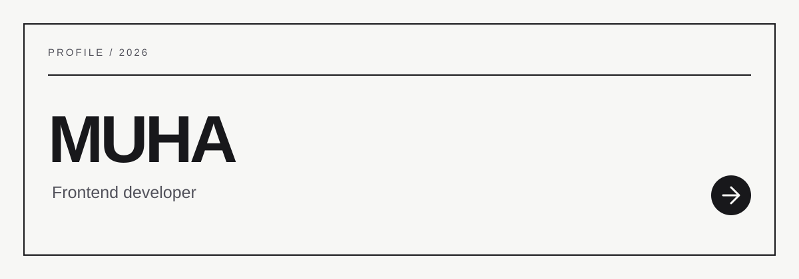
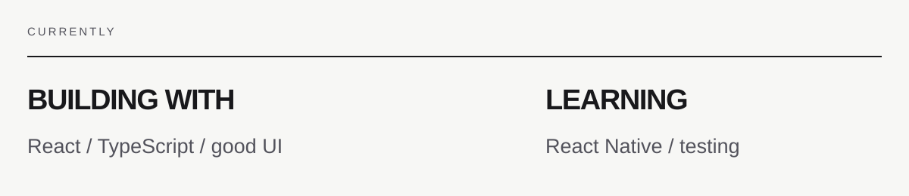

<picture>
  <source media="(prefers-color-scheme: dark)" srcset="assets/dark/header-v2.svg" />
  
</picture>

 

<a href="mailto:ismonovmukh@gmail.com">
  <picture>
    <source media="(prefers-color-scheme: dark)" srcset="https://img.shields.io/badge/EMAIL-0D1117?style=flat-square&logo=gmail&logoColor=white" />
    
  </picture>
</a>
<a href="https://github.com/Whitelistedd">
  <picture>
    <source media="(prefers-color-scheme: dark)" srcset="https://img.shields.io/badge/GITHUB-0D1117?style=flat-square&logo=github&logoColor=white" />
    
  </picture>
</a>

<picture>
  <source media="(prefers-color-scheme: dark)" srcset="assets/dark/profile-v2.svg" />
  
</picture>
