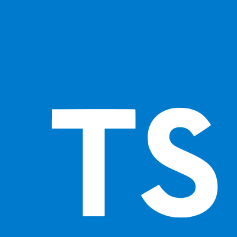
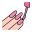

# Привет

 
 

## Я фронтенд-разработчик!

- 🌱 Сейчас я изучаю тестирование 🤣
- 👯 Я хочу сотрудничать с другими людьми
- 🥅 Цели: полностью изучить React Native
- ⚡ Интересный факт: люблю кататься на сноуборде и играть в теннис

### Свяжитесь со мной:
&nbsp;&nbsp;

### Языки и инструменты:

